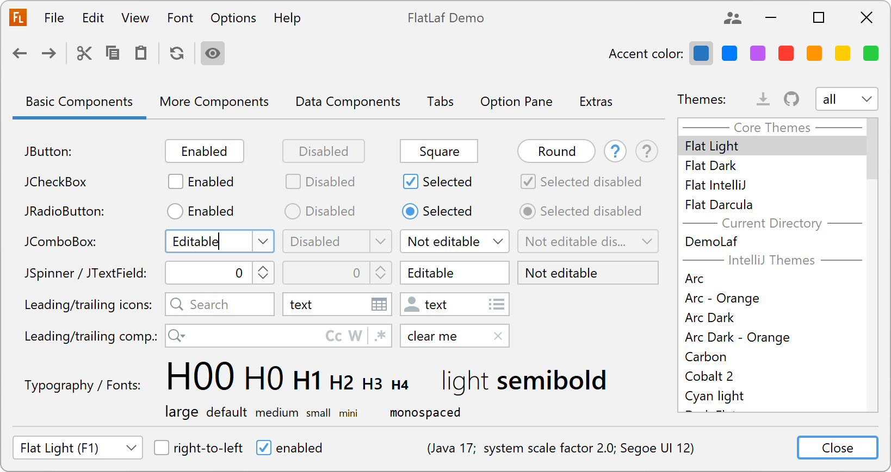
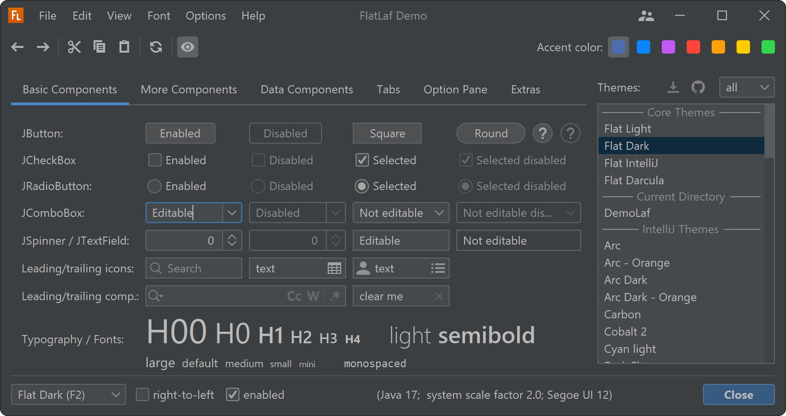

FlatLaf - Flat Look and Feel
============================

**FlatLaf** is a modern **open-source** cross-platform Look and Feel for Java
Swing desktop applications.

It looks almost flat (no shadows or gradients), clean, simple and elegant.
FlatLaf comes with **Light**, **Dark**, **IntelliJ** and **Darcula** themes,
scales on **HiDPI** displays and runs on Java 8 or newer (LTS and latest).

The look is heavily inspired by **Darcula** and **IntelliJ** themes from
IntelliJ IDEA 2019.2+ and uses almost the same colors and icons.

macOS Themes
------------

IntelliJ Platform Themes
------------------------

FlatLaf can use 3rd party themes created for IntelliJ Platform (see
[IntelliJ Themes Pack](flatlaf-intellij-themes)):

Sponsors
--------

### Current Sponsors

[Become a Sponsor](https://www.formdev.com/flatlaf/sponsor/)

### Previous Sponsors

&nbsp; &nbsp; &nbsp; &nbsp;

&nbsp; &nbsp; &nbsp; &nbsp;

Demo
----

Run demo with `java -jar flatlaf-demo-<version>.jar` (or double-click it).
Requires Java 8 or newer.

Download
--------

FlatLaf binaries are available on **Maven Central**.

If you use Maven or Gradle, add a dependency with following coordinates to your
build script:

    groupId:     com.formdev
    artifactId:  flatlaf
    version:     (see button below)

Otherwise, download `flatlaf-<version>.jar` here:

See also
[Native Libraries distribution](https://www.formdev.com/flatlaf/native-libraries/)
for instructions on how to redistribute FlatLaf native libraries with your
application.

### Snapshots

FlatLaf snapshot binaries are available on
[Sonatype OSSRH](https://oss.sonatype.org/content/repositories/snapshots/com/formdev/flatlaf/).
To access the latest snapshot, change the FlatLaf version in your dependencies
to `<version>-SNAPSHOT` (e.g. `0.27-SNAPSHOT`) and add the repository
`https://oss.sonatype.org/content/repositories/snapshots/` to your build (see
[Maven](https://maven.apache.org/guides/mini/guide-multiple-repositories.html)
and
[Gradle](https://docs.gradle.org/current/userguide/declaring_repositories.html#sec:declaring_custom_repository)
docs).

Addons
------

- [IntelliJ Themes Pack](flatlaf-intellij-themes) - bundles many popular
  open-source 3rd party themes
- [Extras](flatlaf-extras) - SVG icon, tri-state check box, UI inspectors, and
  more
- [SwingX](flatlaf-swingx) - support for SwingX components
- [JIDE Common Layer](flatlaf-jide-oss) - support for JIDE Common Layer
  components
- [Fonts](flatlaf-fonts) - some font families bundled in easy-to-use and
  redistributable JARs

Getting started
---------------

To use FlatLaf, add following code to your main method before you create any
Swing component:

~~~java
FlatLightLaf.setup();

// create UI here...
~~~

Documentation
-------------

For more information and documentation visit
[FlatLaf Home](https://www.formdev.com/flatlaf/):

- [Themes](https://www.formdev.com/flatlaf/themes/)
- [Customizing](https://www.formdev.com/flatlaf/customizing/)
- [How to Customize](https://www.formdev.com/flatlaf/how-to-customize/)
- [Properties Files](https://www.formdev.com/flatlaf/properties-files/)
- [Components UI Properties](https://www.formdev.com/flatlaf/components/)
- [Typography](https://www.formdev.com/flatlaf/typography/)
- [Client Properties](https://www.formdev.com/flatlaf/client-properties/)
- [System Properties](https://www.formdev.com/flatlaf/system-properties/)

Theme Editor
------------

The Theme Editor that supports editing FlatLaf theme properties files. See
[Theme Editor documentation](https://www.formdev.com/flatlaf/theme-editor/) for
details and downloads.

Buzz
----

- [FlatLaf 3.1 (and 3.0) announcement on Reddit](https://www.reddit.com/r/java/comments/12xgrsu/flatlaf_31_and_30_swing_look_and_feel/)
- [FlatLaf 1.0 announcement on Reddit](https://www.reddit.com/r/java/comments/lsbcwe/flatlaf_10_swing_look_and_feel/)
- [FlatLaf announcement on Reddit](https://www.reddit.com/r/java/comments/dl0hu3/flatlaf_flat_look_and_feel/)

Applications using FlatLaf
--------------------------

### Featured

-  [JFormDesigner](https://www.formdev.com/)
  (**commercial**) - Java/Swing GUI Designer (from the FlatLaf creators)
- 
  [JProfiler](https://www.ej-technologies.com/products/jprofiler/overview.html)
  (**commercial**) - the award-winning all-in-one Java profiler
- 
  [install4j](https://www.ej-technologies.com/products/install4j/overview.html)
  (**commercial**) - the powerful multi-platform Java installer builder
-  [DbVisualizer](https://www.dbvis.com/)
  (**commercial**) - the universal database tool for developers, analysts and
  DBAs
-  [Apache NetBeans](https://netbeans.apache.org/) - IDE
  for Java, PHP, HTML and much more
- 
  [Thermo-Calc](https://thermocalc.com/products/thermo-calc/) (**commercial**) -
  Thermodynamics and Properties Software

### Data

-  [Ultorg](https://www.ultorg.com/) (**commercial**) - a
  visual query system for relational databases
- [Jailer](https://github.com/Wisser/Jailer) - database subsetting and
  relational data browsing tool
-  [MagicPlot](https://magicplot.com/) (**commercial**) -
  Software for nonlinear fitting, plotting and data analysis
-  [Constellation](https://www.constellation-app.com/) -
  Data Visualization and Analytics (based on NetBeans platform)
- 
  [Kafka Visualizer](https://github.com/kumait/kafkavisualizer) - Kafka GUI
  client

### Security

-  [ZAP](https://www.zaproxy.org/) - the world's most
  widely used web app scanner
- 
  [Burp Suite Professional and Community Edition](https://portswigger.net/burp/pro)
  (**commercial**) - the leading software for web security testing
- 
  [Ghidra](https://github.com/NationalSecurityAgency/ghidra) - a software
  reverse engineering (SRE) framework
-  [jadx](https://github.com/skylot/jadx) - Dex to Java
  decompiler
- [BurpCustomizer](https://github.com/CoreyD97/BurpCustomizer) - adds more
  FlatLaf themes to Burp Suite
- [Total Validator](https://www.totalvalidator.com/) (**commercial**) - checks
  your website
- [JPass](https://github.com/gaborbata/jpass) - password manager with strong
  encryption

### Software Development

- [jclasslib bytecode viewer](https://github.com/ingokegel/jclasslib)
- [KeyStore Explorer](https://keystore-explorer.org/)
- 
  [muCommander](https://github.com/mucommander/mucommander) - lightweight
  cross-platform file manager
-  [Guiffy](https://www.guiffy.com/) (**commercial**) -
  advanced cross-platform Diff/Merge
-  [HashGarten](https://github.com/jonelo/HashGarten) -
  cross-platform Swing GUI for Jacksum
- [Pseudo Assembler IDE](https://github.com/tomasz-herman/PseudoAssemblerIDE) -
  IDE for Pseudo-Assembler
- [Linotte](https://github.com/cpc6128/LangageLinotte) - French programming
  language created to learn programming
- [lsfusion platform](https://github.com/lsfusion/platform) - information
  systems development platform

### Electrical

- [Antares](https://www.antarescircuit.io/) - a free, powerful platform for
  designing, simulating and explaining digital circuits
- [Logisim-evolution](https://github.com/logisim-evolution/logisim-evolution) -
  Digital logic design tool and simulator
- [Makelangelo Software](https://github.com/MarginallyClever/Makelangelo-software) -
  for plotters, especially the wall-hanging polargraph
- [GUIslice Builder](https://github.com/ImpulseAdventure/GUIslice-Builder) - GUI
  builder for [GUIslice](https://github.com/ImpulseAdventure/GUIslice), a
  lightweight GUI framework for embedded displays
- [ThunderFocus](https://github.com/marcocipriani01/ThunderFocus) -
  Arduino-based telescope focuser
- [RemoteLight](https://github.com/Drumber/RemoteLight) - multifunctional LED
  control software

### Media

-  [jAlbum](https://jalbum.net/) (**commercial**) -
  creates photo album websites
-  [MediathekView](https://mediathekview.de/) - search in
  media libraries of various German broadcasters
- [Cinecred](https://loadingbyte.com/cinecred/) - create beautiful film credit
  sequences
- [tinyMediaManager](https://www.tinymediamanager.org/) (**commercial**) - a
  media management tool
- [Weasis](https://nroduit.github.io/) - medical DICOM viewer used in healthcare
  by hospitals, health networks, etc
- [Shutter Encoder](https://www.shutterencoder.com/)
  ([source code](https://github.com/paulpacifico/shutter-encoder)) -
  professional video converter and compression tool
- [Sound Analysis](https://github.com/tomasz-herman/SoundAnalysis) - analyze
  sound files in time or frequency domain
- [Novel-Grabber](https://github.com/Flameish/Novel-Grabber) - download novels
  from any webnovel and lightnovel site
- [lectureStudio](https://www.lecturestudio.org/) - digitize your lectures with
  ease

### Modelling

-  [Astah](https://astah.net/) (**commercial**) - create
  UML, ER Diagram, Flowchart, Data Flow Diagram, Requirement Diagram, SysML
  diagrams and more
- [IGMAS+](https://www.gfz-potsdam.de/igmas) - Interactive Gravity and Magnetic
  Application System

### Documents

-  [Big Faceless (BFO) PDF Viewer](https://bfo.com/)
  (**commercial**) - Swing PDF Viewer
- [PDF Studio](https://www.qoppa.com/pdfstudio/) (**commercial**) - create,
  review and edit PDF documents
- [XMLmind XML Editor](https://www.xmlmind.com/xmleditor/) (**commercial**)

### Geo

-  [JOSM](https://josm.openstreetmap.de/) - an extensible
  editor for [OpenStreetMap](https://www.openstreetmap.org/) (requires FlatLaf
  JOSM plugin)
- [Mapton](https://mapton.org/)
  ([source code](https://github.com/trixon/mapton)) - some kind of map
  application (based on NetBeans platform)
- [MeteoInfo](https://github.com/meteoinfo/MeteoInfo) - GIS and scientific
  computation environment for meteorological community

### Business / Legal

- 
  [j-lawyer](https://github.com/jlawyerorg/j-lawyer-org) - Kanzleisoftware
-  [Jeyla Studio](https://www.jeylastudio.com/) -
  Salon Software
- [Fanurio](https://www.fanuriotimetracking.com/) (**commercial**) - time
  tracking and billing for freelancers and teams
- [Jes](https://www.jes-eur.de) - Die Java-EÜR
- [mendelson AS2](https://sourceforge.net/projects/mec-as2/),
  [AS4](https://sourceforge.net/projects/mendelson-as4/) and
  [OFTP2](https://sourceforge.net/projects/mendelson-oftp2/) (open-source) and
  [mendelson AS2](https://mendelson-e-c.com/as2/),
  [AS4](https://mendelson-e-c.com/as4/) and
  [OFTP2](https://mendelson-e-c.com/oftp2) (**commercial**)

### Messaging

-  [Spark](https://github.com/igniterealtime/Spark) -
  cross-platform IM client optimized for businesses and organizations
-  [Chatty](https://github.com/chatty/chatty) - Twitch
  Chat Client

### Gaming

-  
  [BGBlitz](https://www.bgblitz.com/) (**commercial**) - professional Backgammon
-  [MCreator](https://github.com/MCreator/MCreator) - 
  software used to make Minecraft Java Edition mods, Minecraft Bedrock Edition Add-Ons, 
  and data packs without programming knowledge
-  [MapTool](https://github.com/RPTools/maptool) - virtual
  Tabletop for playing role-playing games
- [MegaMek](https://github.com/MegaMek/megamek),
  [MegaMekLab](https://github.com/MegaMek/megameklab) and
  [MekHQ](https://github.com/MegaMek/mekhq) - a sci-fi tabletop BattleTech
  simulator suite handling battles, unit building, and campaigns
- [ControllerBuddy](https://github.com/bwRavencl/ControllerBuddy) - advanced
  gamepad mapping software

### Utilities

- [MooInfo](https://github.com/rememberber/MooInfo) - visual implementation of
  OSHI, to view information about the system and hardware
- 
  [Linux Task Manager (LTM)](https://github.com/ajee10x/LTM-LinuxTaskManager) -
  GUI for monitoring and managing various aspects of a Linux system
- [Rest Suite](https://github.com/supanadit/restsuite) - Rest API testing
- [SpringRemote](https://github.com/HaleyWang/SpringRemote) - remote Linux SSH
  connections manager
- [jEnTunnel](https://github.com/ggrandes/jentunnel) - manage SSH Tunnels made
  easy
- [Android Tool](https://github.com/fast-geek/Android-Tool) - makes popular adb
  and fastboot commands easier to use

### Miscellaneous

- [MEKA](https://github.com/Waikato/meka) - multi-label classifiers and
  evaluation procedures using the Weka machine learning framework
