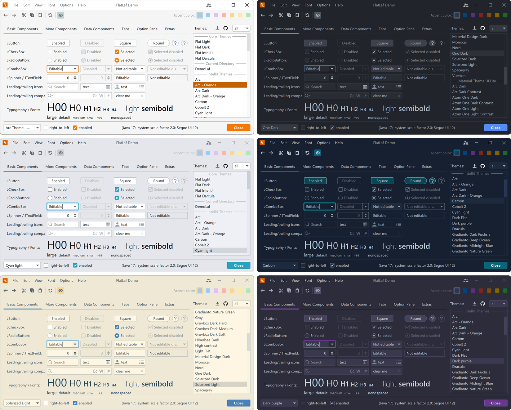
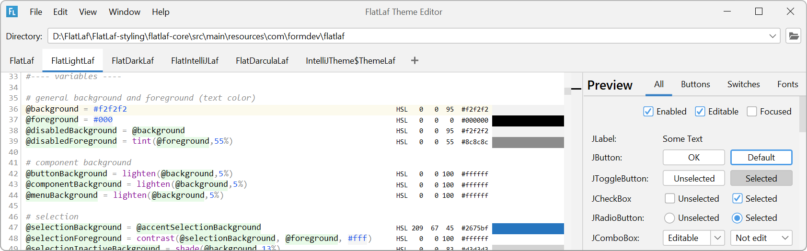

FlatLaf - Flat Look and Feel
============================

**FlatLaf** is a modern **open-source** cross-platform Look and Feel for Java
Swing desktop applications.

It looks almost flat (no shadows or gradients), clean, simple and elegant.
FlatLaf comes with **Light**, **Dark**, **IntelliJ** and **Darcula** themes,
scales on **HiDPI** displays and runs on Java 8 or newer.

The look is heavily inspired by **Darcula** and **IntelliJ** themes from
IntelliJ IDEA 2019.2+ and uses almost the same colors and icons.

macOS Themes
------------

IntelliJ Platform Themes
------------------------

FlatLaf can use 3rd party themes created for IntelliJ Platform (see
[IntelliJ Themes Pack](flatlaf-intellij-themes)):

Sponsors
--------

&nbsp; &nbsp; &nbsp; &nbsp;

&nbsp; &nbsp; &nbsp; &nbsp;

[Become a Sponsor](https://www.formdev.com/flatlaf/sponsor/)

Demo
----

Run demo with `java -jar flatlaf-demo-<version>.jar` (or double-click it).
Requires Java 8 or newer.

Download
--------

FlatLaf binaries are available on **Maven Central**.

If you use Maven or Gradle, add a dependency with following coordinates to your
build script:

    groupId:     com.formdev
    artifactId:  flatlaf
    version:     (see button below)

Otherwise download `flatlaf-<version>.jar` here:

See also
[Native Libraries distribution](https://www.formdev.com/flatlaf/native-libraries/)
for instructions on how to redistribute FlatLaf native libraries with your
application.

### Snapshots

FlatLaf snapshot binaries are available on
[Sonatype OSSRH](https://oss.sonatype.org/content/repositories/snapshots/com/formdev/flatlaf/).
To access the latest snapshot, change the FlatLaf version in your dependencies
to `<version>-SNAPSHOT` (e.g. `0.27-SNAPSHOT`) and add the repository
`https://oss.sonatype.org/content/repositories/snapshots/` to your build (see
[Maven](https://maven.apache.org/guides/mini/guide-multiple-repositories.html)
and
[Gradle](https://docs.gradle.org/current/userguide/declaring_repositories.html#sec:declaring_custom_repository)
docs).

Addons
------

- [IntelliJ Themes Pack](flatlaf-intellij-themes) - bundles many popular
  open-source 3rd party themes
- [Extras](flatlaf-extras) - SVG icon, tri-state check box, UI inspectors, and
  more
- [SwingX](flatlaf-swingx) - support for SwingX components
- [JIDE Common Layer](flatlaf-jide-oss) - support for JIDE Common Layer
  components
- [Fonts](flatlaf-fonts) - some font families bundled in easy-to-use and
  redistributable JARs

Getting started
---------------

To use FlatLaf, add following code to your main method before you create any
Swing component:

~~~java
FlatLightLaf.setup();

// create UI here...
~~~

Documentation
-------------

For more information and documentation visit
[FlatLaf Home](https://www.formdev.com/flatlaf/):

- [Themes](https://www.formdev.com/flatlaf/themes/)
- [Customizing](https://www.formdev.com/flatlaf/customizing/)
- [How to Customize](https://www.formdev.com/flatlaf/how-to-customize/)
- [Properties Files](https://www.formdev.com/flatlaf/properties-files/)
- [Components UI Properties](https://www.formdev.com/flatlaf/components/)
- [Typography](https://www.formdev.com/flatlaf/typography/)
- [Client Properties](https://www.formdev.com/flatlaf/client-properties/)
- [System Properties](https://www.formdev.com/flatlaf/system-properties/)

Theme Editor
------------

The Theme Editor that supports editing FlatLaf theme properties files. See
[Theme Editor documentation](https://www.formdev.com/flatlaf/theme-editor/) for
details and downloads.

Buzz
----

- [What others say about FlatLaf on Twitter](https://twitter.com/search?f=live&q=flatlaf)
- [FlatLaf 1.0 announcement on Reddit](https://www.reddit.com/r/java/comments/lsbcwe/flatlaf_10_swing_look_and_feel/)
- [FlatLaf announcement on Reddit](https://www.reddit.com/r/java/comments/dl0hu3/flatlaf_flat_look_and_feel/)

Applications using FlatLaf
--------------------------

- 
  [Spark](https://github.com/igniterealtime/Spark) - cross-platform IM client optimized for businesses and organizations.
- 
  [Kafka Visualizer](https://github.com/kumait/kafkavisualizer) Kafka GUI client
- 
  [JProfiler](https://www.ej-technologies.com/products/jprofiler/overview.html)
  12 (**commercial**) - the award-winning all-in-one Java profiler
-  [JFormDesigner](https://www.formdev.com/) 8
  (**commercial**) - Java/Swing GUI Designer
-  [Jeyla Studio](https://www.jeylastudio.com/) - Salon
  Software
-  [Fanurio](https://www.fanuriotimetracking.com/) 3.3.2
  (**commercial**) - time tracking and billing for freelancers and teams
-  [Antares](https://www.antarescircuit.io/) - a free,
  powerful platform for designing, simulating and explaining digital circuits
- 
  [Logisim-evolution](https://github.com/logisim-evolution/logisim-evolution)
  3.6 - Digital logic design tool and simulator
-  [Cinecred](https://loadingbyte.com/cinecred/) - create
  beautiful film credit sequences
-  [tinyMediaManager](https://www.tinymediamanager.org/)
  v4 (**commercial**) - a media management tool
-  [Weasis](https://nroduit.github.io/) - medical DICOM
  viewer used in healthcare by hospitals, health networks, etc
- 
  [Makelangelo Software](https://github.com/MarginallyClever/Makelangelo-software)
  7.3.0 - for plotters, especially the wall-hanging polargraph
-  [Ultorg](https://www.ultorg.com/) (**commercial**) - a
  visual query system for relational databases
- [MooInfo](https://github.com/rememberber/MooInfo) - visual implementation of
  OSHI, to view information about the system and hardware
- [Jailer](https://github.com/Wisser/Jailer) 11.2 - database subsetting and
  relational data browsing tool
-  [Apache NetBeans](https://netbeans.apache.org/) 11.3 -
  IDE for Java, PHP, HTML and much more
- [jclasslib bytecode viewer](https://github.com/ingokegel/jclasslib) 5.5
- [KeyStore Explorer](https://keystore-explorer.org/) 5.4.3
- 
  [install4j](https://www.ej-technologies.com/products/install4j/overview.html)
  9.0 (**commercial**) - the powerful multi-platform Java installer builder
-  [DbVisualizer](https://www.dbvis.com/) 12.0
  (**commercial**) - the universal database tool for developers, analysts and
  DBAs
-  [MagicPlot](https://magicplot.com/) 3.0
  (**commercial**) - Software for nonlinear fitting, plotting and data analysis
- 
  [Thermo-Calc](https://thermocalc.com/products/thermo-calc/) 2021a
  (**commercial**) - Thermodynamics and Properties Software
-  [OWASP ZAP](https://www.zaproxy.org/) 2.10 - the worlds
  most widely used web app scanner
- 
  [Burp Suite Professional and Community Edition](https://portswigger.net/burp/pro)
  2020.11.2 (**commercial**) - the leading software for web security testing
- [BurpCustomizer](https://github.com/CoreyD97/BurpCustomizer) - adds more
  FlatLaf themes to Burp Suite
-  [JOSM](https://josm.openstreetmap.de/) - an extensible
  editor for [OpenStreetMap](https://www.openstreetmap.org/) (requires FlatLaf
  JOSM plugin)
-  [jAlbum](https://jalbum.net/) 21 (**commercial**) -
  creates photo album websites
- [PDF Studio](https://www.qoppa.com/pdfstudio/) 2021 (**commercial**) - create,
  review and edit PDF documents
- [XMLmind XML Editor](https://www.xmlmind.com/xmleditor/) 9.3 (**commercial**)
- [Total Validator](https://www.totalvalidator.com/) 15 (**commercial**) -
  checks your website
- [j-lawyer](https://github.com/jlawyerorg/j-lawyer-org) - Kanzleisoftware
- [MegaMek](https://github.com/MegaMek/megamek),
  [MegaMekLab](https://github.com/MegaMek/megameklab) and
  [MekHQ](https://github.com/MegaMek/mekhq) v0.47.5+ - a sci-fi tabletop
  BattleTech simulator suite handling battles, unit building, and campaigns
- [GUIslice Builder](https://github.com/ImpulseAdventure/GUIslice-Builder)
  0.13.b024 - GUI builder for
  [GUIslice](https://github.com/ImpulseAdventure/GUIslice), a lightweight GUI
  framework for embedded displays
- [Rest Suite](https://github.com/supanadit/restsuite) - Rest API testing
- [ControllerBuddy](https://github.com/bwRavencl/ControllerBuddy) - advanced
  gamepad mapping software
- [SpringRemote](https://github.com/HaleyWang/SpringRemote) - remote Linux SSH
  connections manager
- [jEnTunnel](https://github.com/ggrandes/jentunnel) - manage SSH Tunnels made
  easy
- [mendelson AS2](https://sourceforge.net/projects/mec-as2/),
  [AS4](https://sourceforge.net/projects/mendelson-as4/) and
  [OFTP2](https://sourceforge.net/projects/mendelson-oftp2/) (open-source) and
  [mendelson AS2](https://mendelson-e-c.com/as2/),
  [AS4](https://mendelson-e-c.com/as4/) and
  [OFTP2](https://mendelson-e-c.com/oftp2) (**commercial**)
- [IGMAS+](https://www.gfz-potsdam.de/igmas) - Interactive Gravity and Magnetic
  Application System
- [MeteoInfo](https://github.com/meteoinfo/MeteoInfo) 2.2 - GIS and scientific
  computation environment for meteorological community
- [lsfusion platform](https://github.com/lsfusion/platform) 4 - information
  systems development platform
- [JPass](https://github.com/gaborbata/jpass) - password manager with strong
  encryption
- [Jes - Die Java-EÜR](https://www.jes-eur.de)
- [Mapton](https://mapton.org/) 2.0
  ([source code](https://github.com/trixon/mapton)) - some kind of map
  application (based on NetBeans platform)
- [Pseudo Assembler IDE](https://github.com/tomasz-herman/PseudoAssemblerIDE) -
  IDE for Pseudo-Assembler
- [Linotte](https://github.com/cpc6128/LangageLinotte) 3.1 - French programming
  language created to learn programming
- [MEKA](https://github.com/Waikato/meka) 1.9.3 - multi-label classifiers and
  evaluation procedures using the Weka machine learning framework
- [Shutter Encoder](https://www.shutterencoder.com/) 14.2
  ([source code](https://github.com/paulpacifico/shutter-encoder)) -
  professional video converter and compression tool (screenshots show **old**
  look)
- [Sound Analysis](https://github.com/tomasz-herman/SoundAnalysis) - analyze
  sound files in time or frequency domain
- [RemoteLight](https://github.com/Drumber/RemoteLight) - multifunctional LED
  control software
- [ThunderFocus](https://github.com/marcocipriani01/ThunderFocus) -
  Arduino-based telescope focuser
- [Novel-Grabber](https://github.com/Flameish/Novel-Grabber) - download novels
  from any webnovel and lightnovel site
- [lectureStudio](https://www.lecturestudio.org/) 4.3.1060 - digitize your
  lectures with ease
- [Android Tool](https://github.com/fast-geek/Android-Tool) - makes popular adb
  and fastboot commands easier to use
- and more...
