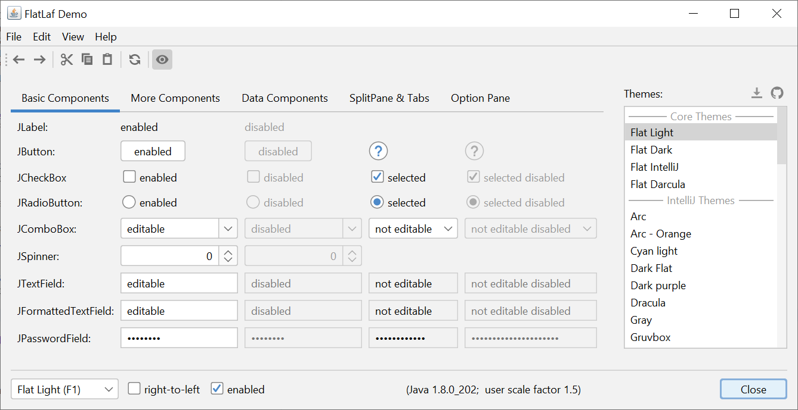

FlatLaf - Flat Look and Feel
============================

**FlatLaf** is a modern open-source cross-platform Look and Feel for Java
desktop applications.

It is mostly "flat" (no shadows or gradients), clean, simple and elegant. It
comes with **Light** and **Dark** themes and is made for **HiDPI** displays.

The look is heavily inspired by **Darcula** and **IntelliJ** themes from
IntelliJ IDEA 2019.2+ and uses mostly the same colors and icons.

Demo
----

Download
[flatlaf-demo-0.9.jar](https://download.formdev.com/flatlaf/flatlaf-demo-0.9.jar)
and run it with `java -jar flatlaf-demo-0.9.jar` (or double-click it). Requires
Java 8 or newer.

Download
--------

For Maven or Gradle use:

    Repository:   jcenter (https://jcenter.bintray.com/) 
    Group Id:     com.formdev.flatlaf
    Artifact Id:  flatlaf-core
    Version:      0.9

License
-------

FlatLaf is open source licensed under the [Apache 2.0 License](LICENSE)
