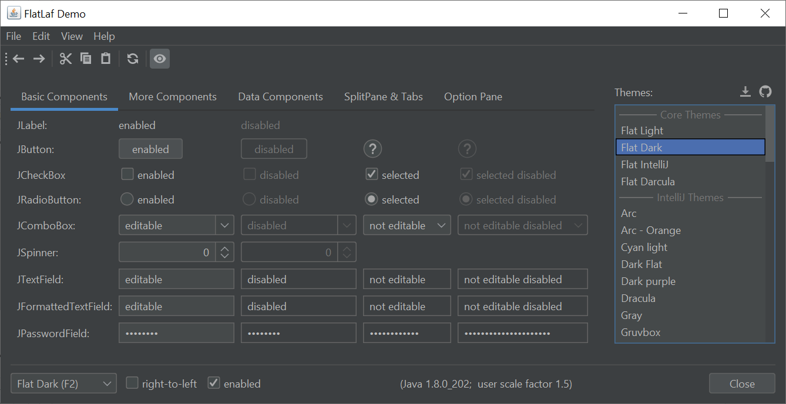

FlatLaf - Flat Look and Feel
============================

**FlatLaf** is a modern **open-source** cross-platform Look and Feel for Java
Swing desktop applications.

It looks almost flat (no shadows or gradients), clean, simple and elegant.
FlatLaf comes with **Light**, **Dark**, **IntelliJ** and **Darcula** themes,
scales on **HiDPI** displays and runs on Java 8 or newer.

The look is heavily inspired by **Darcula** and **IntelliJ** themes from
IntelliJ IDEA 2019.2+ and uses almost the same colors and icons.

IntelliJ Platform Themes
------------------------

FlatLaf can use 3rd party themes created for IntelliJ Platform:

Demo
----

Run demo with `java -jar flatlaf-demo-<version>.jar` (or double-click it).
Requires Java 8 or newer.

Download
--------

FlatLaf binaries are available on **JCenter** and **Maven Central**.

If you use Maven or Gradle, add a dependency with following coordinates to your
build script:

    groupId:     com.formdev
    artifactId:  flatlaf
    version:     (see button below)

Otherwise download `flatlaf-<version>.jar` here:

### Snapshots

FlatLaf snapshot binaries are available in
[JFrog Artifactory](https://oss.jfrog.org/artifactory/oss-snapshot-local/com/formdev/).
To access the latest snapshot, change the FlatLaf version(s) in the dependencies
to `<version>-SNAPSHOT` (e.g. `0.27-SNAPSHOT`) and add the repository
`https://oss.jfrog.org/artifactory/oss-snapshot-local` to your build (see
[Maven](https://maven.apache.org/guides/mini/guide-multiple-repositories.html)
and
[Gradle](https://docs.gradle.org/current/userguide/declaring_repositories.html#sec:declaring_custom_repository)
docs).

Addons
------

- [SwingX](flatlaf-swingx)
- [JIDE Common Layer](flatlaf-jide-oss)

Projects using FlatLaf
----------------------

- [NetBeans](https://netbeans.apache.org/) 11.3
- [jclasslib bytecode viewer](https://github.com/ingokegel/jclasslib) 5.5
- [j-lawyer](https://github.com/jlawyerorg/j-lawyer-org)
- [Rest Suite](https://github.com/supanadit/restsuite)
- [ControllerBuddy](https://github.com/bwRavencl/ControllerBuddy)
- [SpringRemote](https://github.com/HaleyWang/SpringRemote)
- and more...

Documentation
-------------

For more information and documentation visit
[FlatLaf Home](https://www.formdev.com/flatlaf/)
