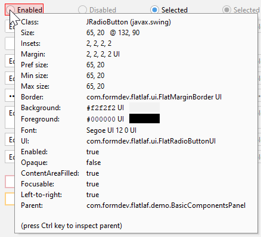

FlatLaf Extras
==============

This sub-project provides some additional components and classes:

- [FlatSVGIcon](https://www.javadoc.io/doc/com.formdev/flatlaf-extras/latest/com/formdev/flatlaf/extras/FlatSVGIcon.html):
  An icon that displays SVG using [JSVG](https://github.com/weisJ/jsvg).\
  
- [FlatTriStateCheckBox](https://www.javadoc.io/doc/com.formdev/flatlaf-extras/latest/com/formdev/flatlaf/extras/components/FlatTriStateCheckBox.html):
  A tri-state check box.\
  
- Extension classes of standard Swing components that provide easy access to
  FlatLaf specific client properties (see package
  [com.formdev.flatlaf.extras.components](https://www.javadoc.io/doc/com.formdev/flatlaf-extras/latest/com/formdev/flatlaf/extras/components/package-summary.html)).
- [FlatAnimatedLafChange](https://www.javadoc.io/doc/com.formdev/flatlaf-extras/latest/com/formdev/flatlaf/extras/FlatAnimatedLafChange.html):
  Animated Laf (theme) changing.
- [FlatInspector](#ui-inspector): A simple UI inspector that shows information
  about UI component at mouse location in a tooltip.
- [FlatUIDefaultsInspector](#ui-defaults-inspector): A simple UI defaults
  inspector that shows a window with all UI defaults used in current theme (look
  and feel).

Download
--------

FlatLaf Extras binaries are available on **Maven Central**.

If you use Maven or Gradle, add a dependency with following coordinates to your
build script:

    groupId:     com.formdev
    artifactId:  flatlaf-extras
    version:     (see button below)

Otherwise, download `flatlaf-extras-<version>.jar` here:

If SVG classes are used, `jsvg-<version>.jar` is also required:

Supported JSVG versions:

- FlatLaf 3.7+ supports JSVG 1.6.0 and later.
- FlatLaf 3.6- supports only JSVG 1.x (but not 2.x).

Tools
-----

### UI Inspector

A simple UI inspector that shows information about UI component at mouse
location in a tooltip, which may be useful while developing an application.
Should not be installed in released applications.

Once installed with following code (e.g. in method `main`), it can be activated
for the active window with the given keystroke:

~~~java
FlatInspector.install( "ctrl shift alt X" );
~~~

When the UI inspector is active some additional keys are available:

- press <kbd>Esc</kbd> key to disable UI inspector
- press <kbd>Ctrl</kbd> key to increase inspection level, which shows
  information about parent of UI component at mouse location
- press <kbd>Shift</kbd> key to decrease inspection level

### UI Defaults Inspector

A simple UI defaults inspector that shows a window with all UI defaults used in
current theme (look and feel), which may be useful while developing an
application. Should be not installed in released applications.

Once installed with following code (e.g. in method `main`), it can be activated
with the given keystroke:

~~~java
FlatUIDefaultsInspector.install( "ctrl shift alt Y" );
~~~

