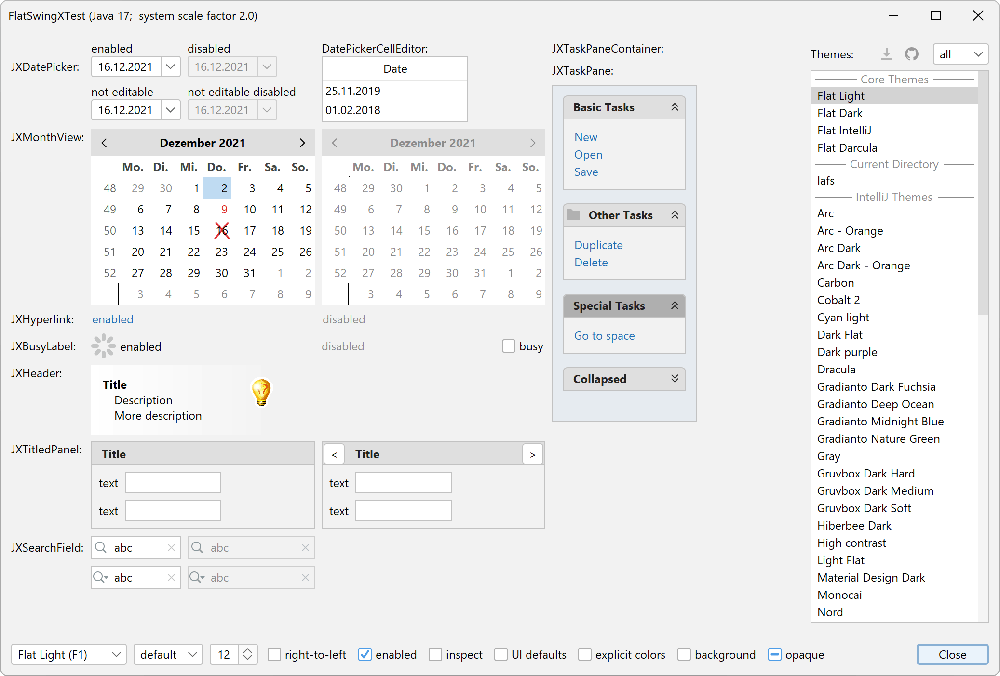

FlatLaf addon for SwingX
========================

This addon for FlatLaf adds support for **some** widely used SwingX components.

Many SwingX components that do not use UI delegates (e.g. `JXButton`, `JXLabel`,
`JXList`, `JXStatusBar`, etc.) work with FlatLaf without adaptation.

Following SwingX components, which use UI delegates, are currently supported by
this addon:

- `JXBusyLabel`
- `JXDatePicker`
- `JXHeader`
- `JXHyperlink`
- `JXMonthView`
- `JXTaskPaneContainer`
- `JXTaskPane`
- `JXTipOfTheDay`
- `JXTitledPanel`

Download
--------

FlatLaf for SwingX binaries are available on **Maven Central**.

If you use Maven or Gradle, add a dependency with following coordinates to your
build script:

    groupId:     com.formdev
    artifactId:  flatlaf-swingx
    version:     (see button below)

Otherwise, download `flatlaf-swingx-<version>.jar` here:

SwingX library `swingx-all-<version>.jar` is also required:

