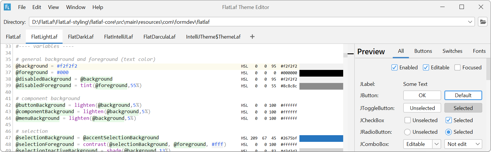

FlatLaf Theme Editor
====================

This sub-project contains the FlatLaf Theme Editor that supports editing FlatLaf
theme properties files. See
[Theme Editor documentation](https://www.formdev.com/flatlaf/theme-editor/) for
details and downloads.

Download
--------

Run with `java -jar flatlaf-theme-editor-<version>.jar` (or double-click it).
Requires Java 8 or newer.
